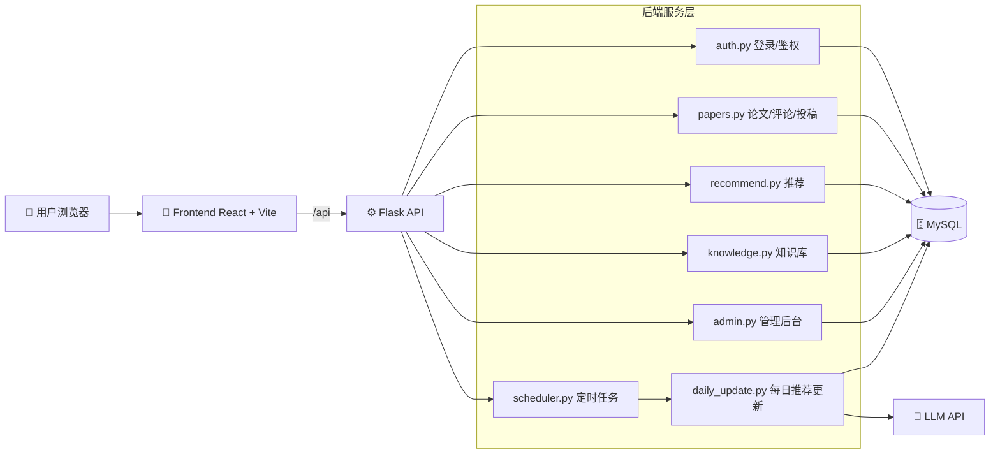

<div align="center">
  <h1>PaperFlow</h1>
  <p><b>面向学术协作与论文内容沉淀的一体化平台</b></p>
  <p>检索 · 阅读 · 推荐 · 讨论 · 投稿 · 审核 · 运营分析</p>
  <p>
    <a href="./LICENSE"></a>
    
    
    
    
    
  </p>
</div>

---

## 🧭 项目定位

PaperFlow 聚焦“学术内容协同生产”：

- 📚 从多来源沉淀论文卡片（系统库 + 创作者投稿）
- 🤖 基于论文内容生成 AI 摘要、关键词和图示解读
- 👥 支持评论、回复、点赞、@提醒、站内消息
- 🛡️ 通过审核流确保内容质量与可追溯性
- 📈 通过后台统计和知识热点追踪支撑运营迭代

## ✨ 核心功能

- 🗂️ `系统论文库`：分页浏览、分类筛选、关键词检索、详情查看
- 🌞 `每日推荐`：定时任务更新，支持偏好权重与推荐策略
- 🧠 `知识库`：语义检索（RAG）与热点方向追踪
- 📝 `创作者中心`：上传 PDF 自动生成卡片，管理员审核后公开
- 💬 `评论系统`：评论/回复/点赞/@提醒/通知
- 🛠️ `管理员后台`：用户管理、投稿审核、纠错审核、推荐任务监控

## 🧱 技术栈

| 层 | 方案 |
|---|---|
| 前端 | React 18 + Vite + React Router + Axios |
| 后端 | Flask + SQLAlchemy + APScheduler |
| 数据库 | MySQL 8.x |
| AI 能力 | OpenAI SDK（兼容 DeepSeek Base URL） |
| 文献处理 | requests / selenium / pdfplumber |
| 鉴权 | JWT |

## 🏗️ 系统架构图



## 🗃️ 目录结构

```text
PaperFlow/
├── backend/
│   ├── app.py                 # Flask 启动与蓝图注册
│   ├── models.py              # 数据模型
│   ├── auth.py                # 注册/登录/JWT
│   ├── papers.py              # 论文、评论、投稿 API
│   ├── recommend.py           # 推荐逻辑
│   ├── knowledge.py           # 知识库检索与热点
│   ├── admin.py               # 管理员后台 API
│   ├── scheduler.py           # 定时任务
│   ├── daily_update.py        # 每日推荐更新
│   └── config.py              # 配置
├── frontend/
│   ├── src/
│   │   ├── pages/             # 页面
│   │   ├── components/        # 公共组件
│   │   ├── api/               # 请求封装
│   │   └── utils/             # 工具函数
│   └── package.json
├── main.py                    # 兼容旧入口（保留）
└── README.md
```

## 🚀 新手一步一步启动（从 0 到可用）

### Step 0. 准备运行环境

- `Python 3.10+`
- `Node.js 18+`（推荐 18 或 20）
- `MySQL 8.x`
- （可选）`Google Chrome`（用于部分站点 PDF 下载兜底）

### Step 1. 克隆项目

```bash
git clone https://github.com/dndxlihao/PaperFlow.git
cd PaperFlow
```

### Step 2. 初始化数据库

```sql
CREATE DATABASE paper_hub CHARACTER SET utf8mb4 COLLATE utf8mb4_unicode_ci;
```

### Step 3. 配置后端环境变量

```bash
cd backend
cp .env.example .env
```

编辑 `backend/.env`，至少填写：

- `DATABASE_URL`
- `SECRET_KEY`
- `DEEPSEEK_API_KEY`
- `DEEPSEEK_BASE_URL`
- `DEEPSEEK_MODEL`

如果你需要管理员后台权限，设置：

- `ADMIN_USERNAMES=manager1,admin`（示例）

### Step 4. 启动后端

```bash
cd backend
pip install -r requirements.txt
python app.py
```

后端默认地址：`http://localhost:5001`

### Step 5. 启动前端

```bash
cd frontend
npm install
npm run dev
```

前端默认地址：`http://localhost:3000`  
开发环境中，Vite 会把 `/api` 请求代理到后端 `5001`。

### Step 6. 首次功能验收（推荐按顺序）

1. 注册普通用户并登录  
2. 检查 `系统论文库` 是否可浏览  
3. 打开 `每日推荐` 查看卡片是否加载  
4. 发布一条评论，测试互动链路  
5. 用管理员账号登录，确认 `管理员后台` 可访问  
6. 在 `创作者中心` 上传一篇测试 PDF，走一遍“投稿 -> 审核 -> 公示”

## 🧪 常用开发命令

```bash
# 后端启动
cd backend && python app.py

# 前端开发
cd frontend && npm run dev

# 前端构建
cd frontend && npm run build
```

## 🔐 隐私与数据策略（协作开发重点）

本仓库仅提交“功能代码 + 配置模板 + 文档”。以下内容默认不入库：

- `docs/`、`backend/docs/`、`figures/`
- `pic/`（含头像等素材）
- `.env`、`backend/.env`
- `backend/embeddings_cache.npz`
- `backend/knowledge_trends_cache.json`

## 🤝 协作规范

- 建议分支命名：`feature/*`、`fix/*`、`chore/*`
- 建议提交前缀：`feat:` `fix:` `chore:` `docs:`
- 提交前自查：是否误包含隐私/大文件

## ❓FAQ

### 1) 前端打开了，但接口返回 401/403？

- 检查是否已登录并携带 JWT
- 检查管理员接口是否用了管理员账号（`ADMIN_USERNAMES`/`ADMIN_EMAILS`）

### 2) 推荐任务为什么没触发？

- 确认后端进程正常运行
- 检查 `scheduler.py` 日志以及 `.env` 的推荐任务配置

### 3) AI 总结没有生成？

- 检查 `DEEPSEEK_API_KEY` 与 `DEEPSEEK_BASE_URL`
- 检查 PDF 是否下载成功、外部源站是否可访问

## 📄 许可证

本项目使用 [MIT License](./LICENSE)。

