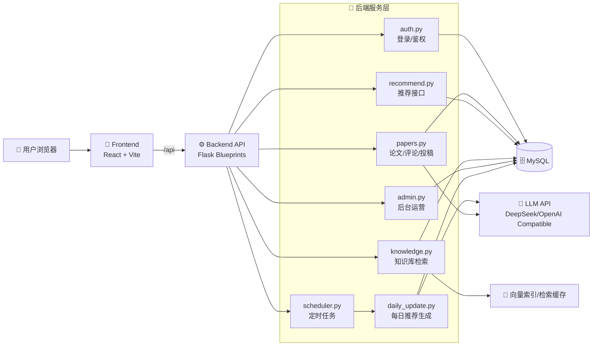

# PaperFlow

[](./LICENSE)


> 一个面向学术协作与论文内容沉淀的平台。  
> 支持论文检索、AI 总结、评论互动、创作者投稿、管理员审核与知识热点分析。

## 🧭 项目定位

PaperFlow 聚焦“学术内容协同生产”：

- 📚 从多来源沉淀论文卡片（系统库 + 创作者投稿）。
- 🤖 基于论文内容生成摘要、关键词和图示解读。
- 👥 支持评论、点赞、回复、@提醒与站内消息。
- 🛡️ 通过审核流程保障卡片质量与可追溯性。
- 📈 通过后台与知识库统计支撑运营迭代。

## ✨ 核心功能

- 🗂️ `系统论文库`：分页浏览、分类筛选、关键词检索、详情查看。
- 🌞 `每日推荐`：定时任务更新，支持偏好权重与推荐策略。
- 🧠 `知识库`：语义检索（RAG）与热点方向追踪。
- 📝 `创作者中心`：用户上传 PDF 生成卡片，管理员审核后公开。
- 💬 `评论系统`：评论、回复、点赞、@好友提醒、站内通知。
- 🛠️ `管理员后台`：用户管理、投稿审核、纠错审核、推荐任务监控。

## 🧱 技术栈

| 层 | 方案 |
|---|---|
| 前端 | React 18 + Vite + React Router + Axios |
| 后端 | Flask + SQLAlchemy + APScheduler |
| 数据库 | MySQL |
| AI 能力 | OpenAI SDK（兼容 DeepSeek Base URL） |
| 文献处理 | requests / selenium / pdfplumber |
| 鉴权 | JWT |

## 🏗️ 系统架构图



## 🗃️ 目录结构

```text
PaperFlow/
├── backend/
│   ├── app.py                 # Flask 启动与蓝图注册
│   ├── models.py              # 数据模型
│   ├── auth.py                # 注册/登录/JWT
│   ├── papers.py              # 论文、评论、投稿 API
│   ├── recommend.py           # 推荐逻辑
│   ├── knowledge.py           # 知识库检索与热点
│   ├── admin.py               # 管理员后台 API
│   ├── scheduler.py           # 定时任务
│   ├── daily_update.py        # 每日推荐更新
│   └── config.py              # 配置
├── frontend/
│   ├── src/
│   │   ├── pages/             # 页面
│   │   ├── components/        # 公共组件
│   │   ├── api/               # 请求封装
│   │   └── utils/             # 工具函数
│   └── package.json
├── main.py                    # 兼容旧入口（保留）
└── README.md
```

## 🚀 新手一步一步启动

### 0) 环境准备

- `Python 3.10+`
- `Node.js 18+`（推荐 18 或 20）
- `MySQL 8.x`
- （可选）`Chrome`：用于部分站点 PDF 下载兜底

### 1) 克隆项目

```bash
git clone https://github.com/dndxlihao/PaperFlow.git
cd PaperFlow
```

### 2) 创建数据库

```sql
CREATE DATABASE paper_hub CHARACTER SET utf8mb4 COLLATE utf8mb4_unicode_ci;
```

### 3) 配置后端环境变量

```bash
cd backend
cp .env.example .env
```

至少要填写以下字段：

- `DATABASE_URL`
- `SECRET_KEY`
- `DEEPSEEK_API_KEY`
- `DEEPSEEK_BASE_URL`
- `DEEPSEEK_MODEL`

如果要开启管理员账号，请在 `.env` 设置：

- `ADMIN_USERNAMES=你的用户名`  
例如：`ADMIN_USERNAMES=manager1,admin`

### 4) 安装后端依赖并启动

```bash
cd backend
pip install -r requirements.txt
python app.py
```

后端默认地址：`http://localhost:5001`

### 5) 安装前端依赖并启动

```bash
cd frontend
npm install
npm run dev
```

前端默认地址：`http://localhost:3000`  
开发环境中，Vite 会把 `/api` 请求代理到 `5001`。

### 6) 首次使用建议

- 先注册一个普通用户，确认基本浏览和检索功能正常。
- 再使用管理员用户名登录，确认后台页可访问。
- 上传一篇测试 PDF，走一遍“投稿 -> 审核 -> 公示”的完整流程。

## 🧪 常用开发命令

```bash
# 启动后端
cd backend && python app.py

# 启动前端
cd frontend && npm run dev

# 前端构建
cd frontend && npm run build
```

## 🤝 协作与提交规范

- 只提交功能代码、配置模板和文档。
- 不提交 PDF、用户隐私数据、密钥、缓存、日志。
- 分支建议：`feature/*`、`fix/*`、`chore/*`。
- Commit 建议使用约定式前缀：`feat:` `fix:` `chore:` `docs:`。

本仓库 `.gitignore` 已排除：

- `docs/`、`backend/docs/`、`figures/`
- `pic/`（含头像等素材）
- `.env`、`backend/.env`
- `backend/embeddings_cache.npz`
- `backend/knowledge_trends_cache.json`

## ❓常见问题（FAQ）

### 1. 前端能打开，但接口 401 或 403？

- 检查是否已登录并带 JWT。
- 检查管理员接口是否使用了管理员账号（`ADMIN_USERNAMES`/`ADMIN_EMAILS`）。

### 2. 推荐任务为什么不触发？

- 确认后端进程未退出。
- 检查 `scheduler.py` 日志以及 `.env` 的推荐任务配置。

### 3. AI 总结没有生成？

- 检查 `DEEPSEEK_API_KEY` 与 `DEEPSEEK_BASE_URL`。
- 检查 PDF 是否下载成功，以及网络是否可访问对应源站。

## 📄 许可证

本项目使用 [MIT License](./LICENSE)。
